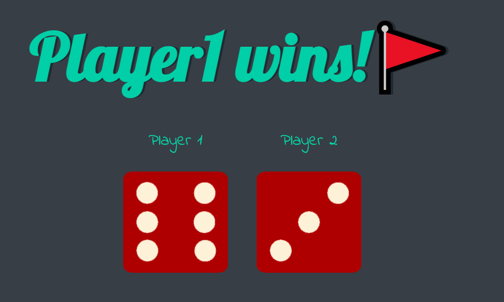

## Random Dice Comparator

### Description

Creates Random dice everytime the page is refreshed
and declares the result on the basis of the numbers.

## Tech Stack

1. HTML
2. CSS
3. Javascript

## Screenshot

